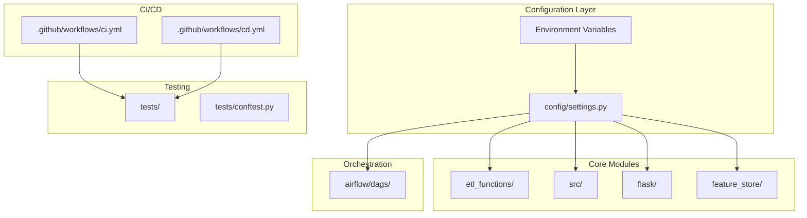

# Design Document: ML Pipeline Refactoring and CI/CD

## Overview

This design document outlines the technical approach for refactoring the ML pipeline codebase and implementing CI/CD with GitHub Actions. The refactoring focuses on three main areas:

1. **Configuration Management**: Replacing hardcoded paths with a centralized configuration system using environment variables and Pydantic settings
2. **Code Quality**: Adding type annotations, linting, and comprehensive testing
3. **CI/CD Pipelines**: Implementing GitHub Actions workflows for automated testing and deployment

The design prioritizes backward compatibility while improving maintainability and reliability.

## Architecture



## Components and Interfaces

### 1. Configuration Manager (`config/settings.py`)

A centralized configuration module using Pydantic BaseSettings for type-safe configuration management.

```python
from pydantic_settings import BaseSettings
from typing import Optional

class Settings(BaseSettings):
    # MLflow Configuration
    mlflow_tracking_uri: str = "http://127.0.0.1:5000/"
    mlflow_experiment_id: str = ""
    
    # Feast Configuration
    feast_repo_path: str = ""
    feast_feature_view: str = "predictors_df_feature_view"
    
    # Data Paths
    data_base_path: str = ""
    artifacts_path: str = ""
    
    # Model Configuration
    model_name: str = "diabete_model"
    
    # API Configuration
    api_host: str = "0.0.0.0"
    api_port: int = 5005
    api_debug: bool = False
    
    class Config:
        env_file = ".env"
        env_prefix = "ML_"

settings = Settings()
```

**Interface**:
- `settings.mlflow_tracking_uri` - MLflow server URL
- `settings.feast_repo_path` - Path to Feast feature repository
- `settings.data_base_path` - Base path for data files
- `settings.artifacts_path` - Path for output artifacts

### 2. ETL Module (`etl_functions/etl.py`)

Refactored ETL functions with configuration injection and proper error handling.

```python
from config.settings import settings
from typing import Tuple
import pandas as pd

def extract(input_path: Optional[str] = None) -> pd.DataFrame:
    """Extract data from CSV file.
    
    Args:
        input_path: Optional override for input file path
        
    Returns:
        DataFrame with raw data
        
    Raises:
        FileNotFoundError: If input file doesn't exist
    """
    path = input_path or f"{settings.data_base_path}/diabetes.csv"
    return pd.read_csv(path)

def transform(df: pd.DataFrame) -> Tuple[pd.DataFrame, pd.Series]:
    """Transform raw data into predictor and target.
    
    Args:
        df: Raw input DataFrame
        
    Returns:
        Tuple of (predictor DataFrame, target Series)
    """
    predictor = df.loc[:, df.columns != "Outcome"]
    target = df["Outcome"]
    return predictor, target
```

### 3. Flask API (`flask/api.py`)

Refactored API with configuration-based initialization and improved error handling.

```python
from config.settings import settings
from flask import Flask, jsonify

app = Flask(__name__)

def create_app(config: Optional[Settings] = None) -> Flask:
    """Application factory for Flask app.
    
    Args:
        config: Optional settings override for testing
        
    Returns:
        Configured Flask application
    """
    cfg = config or settings
    app = Flask(__name__)
    
    # Initialize model manager with config
    model_manager = ModelManager(
        tracking_uri=cfg.mlflow_tracking_uri,
        model_name=cfg.model_name
    )
    
    # Register routes
    register_routes(app, model_manager)
    
    return app
```

### 4. Test Infrastructure (`tests/`)

```
tests/
├── conftest.py           # Shared fixtures
├── unit/
│   ├── test_etl.py       # ETL function tests
│   ├── test_api.py       # Flask API tests
│   └── test_training.py  # Training logic tests
└── integration/
    └── test_pipeline.py  # End-to-end tests
```

**Fixtures** (`tests/conftest.py`):

```python
import pytest
import pandas as pd
from config.settings import Settings

@pytest.fixture
def sample_diabetes_data() -> pd.DataFrame:
    """Sample diabetes dataset for testing."""
    return pd.DataFrame({
        "Pregnancies": [6, 1, 8],
        "Glucose": [148, 85, 183],
        "BloodPressure": [72, 66, 64],
        "SkinThickness": [35, 29, 0],
        "Insulin": [0, 0, 0],
        "BMI": [33.6, 26.6, 23.3],
        "DiabetesPedigreeFunction": [0.627, 0.351, 0.672],
        "Age": [50, 31, 32],
        "Outcome": [1, 0, 1]
    })

@pytest.fixture
def test_settings() -> Settings:
    """Test configuration with mock paths."""
    return Settings(
        mlflow_tracking_uri="http://localhost:5000/",
        data_base_path="/tmp/test_data",
        artifacts_path="/tmp/test_artifacts"
    )
```

### 5. GitHub Actions CI Workflow (`.github/workflows/ci.yml`)

```yaml
name: CI

on:
  pull_request:
    branches: [main, develop]
  push:
    branches: [main]

jobs:
  lint:
    runs-on: ubuntu-latest
    steps:
      - uses: actions/checkout@v4
      - uses: astral-sh/setup-uv@v4
      - run: uv sync --dev
      - run: uv run ruff check .
      - run: uv run ruff format --check .

  type-check:
    runs-on: ubuntu-latest
    steps:
      - uses: actions/checkout@v4
      - uses: astral-sh/setup-uv@v4
      - run: uv sync --dev
      - run: uv run mypy src/ etl_functions/ flask/

  test:
    runs-on: ubuntu-latest
    steps:
      - uses: actions/checkout@v4
      - uses: astral-sh/setup-uv@v4
      - run: uv sync --dev
      - run: uv run pytest tests/ --cov=src --cov=etl_functions
```

### 6. GitHub Actions CD Workflow (`.github/workflows/cd.yml`)

```yaml
name: CD

on:
  push:
    branches: [main]
    tags: ['v*']

jobs:
  test:
    uses: ./.github/workflows/ci.yml
    
  validate-dags:
    runs-on: ubuntu-latest
    steps:
      - uses: actions/checkout@v4
      - uses: astral-sh/setup-uv@v4
      - run: uv sync
      - run: uv run python -c "import airflow.dags.etl; import airflow.dags.train"

  build:
    needs: [test, validate-dags]
    runs-on: ubuntu-latest
    steps:
      - uses: actions/checkout@v4
      - uses: docker/build-push-action@v5
        with:
          context: .
          push: false
          tags: ml-pipeline:${{ github.sha }}
```

## Data Models

### Configuration Schema

```python
class Settings(BaseSettings):
    """Application configuration schema."""
    
    # Required fields (no defaults)
    mlflow_experiment_id: str
    feast_repo_path: str
    data_base_path: str
    
    # Optional fields with defaults
    mlflow_tracking_uri: str = "http://127.0.0.1:5000/"
    model_name: str = "diabete_model"
    api_port: int = 5005
```

### API Request/Response Models

```python
from pydantic import BaseModel, Field
from typing import List, Optional

class PredictionRequest(BaseModel):
    """Single prediction request."""
    Glucose: float = Field(..., ge=0)
    BMI: float = Field(..., ge=0)
    DiabetesPedigreeFunction: float = Field(..., ge=0)
    Insulin: float = Field(..., ge=0)
    SkinThickness: float = Field(..., ge=0)

class PredictionResponse(BaseModel):
    """Prediction response."""
    score: float
    prediction: str
    confidence: float
    model_version: int
    timestamp: str

class BatchPredictionRequest(BaseModel):
    """Batch prediction request."""
    instances: List[PredictionRequest]

class HealthResponse(BaseModel):
    """Health check response."""
    status: str
    timestamp: str
    services: dict
```


## Correctness Properties

*A property is a characteristic or behavior that should hold true across all valid executions of a system—essentially, a formal statement about what the system should do. Properties serve as the bridge between human-readable specifications and machine-verifiable correctness guarantees.*

Based on the acceptance criteria analysis, the following properties can be verified through property-based testing:

### Property 1: Configuration Loading with Fallbacks

*For any* valid combination of environment variables, the Configuration_Manager SHALL correctly load values from environment variables when present, and fall back to default values when environment variables are not set.

**Validates: Requirements 1.1**

This property ensures that:
- When an environment variable is set, its value is used
- When an environment variable is not set, the default value is used
- The precedence order (env var > default) is always respected

### Property 2: API Configuration Injection

*For any* valid Settings configuration provided to the Flask API factory, the created application SHALL use those configuration values for MLflow tracking URI, model name, and API settings.

**Validates: Requirements 6.1**

This property ensures that:
- The API factory correctly accepts configuration injection
- Different configurations produce different API behaviors
- No hardcoded values override injected configuration

### Property 3: API Request Validation

*For any* prediction request with invalid or missing required fields, the Flask API SHALL return a 400 status code with an error message that identifies the specific validation failure.

**Validates: Requirements 6.2**

This property ensures that:
- Missing required fields are detected and reported
- Invalid field types are detected and reported
- Invalid field values (e.g., negative numbers where positive required) are detected
- Error messages are specific and actionable

## Error Handling

### Configuration Errors

| Error Condition | Handling Strategy | User Message |
|----------------|-------------------|--------------|
| Missing required env var | Raise `ValidationError` at startup | "Required configuration '{field}' is not set. Set ML_{FIELD} environment variable." |
| Invalid env var format | Raise `ValidationError` at startup | "Configuration '{field}' has invalid format: {details}" |
| Service unreachable | Log warning, continue with degraded mode | "MLflow server at {uri} is not reachable. Some features may be unavailable." |

### API Errors

| Error Condition | HTTP Status | Response Format |
|----------------|-------------|-----------------|
| Invalid JSON body | 400 | `{"error": "Invalid JSON", "message": "Request body must be valid JSON"}` |
| Missing required field | 400 | `{"error": "Validation Error", "message": "Missing required field: {field}", "expected_fields": [...]}` |
| Invalid field type | 400 | `{"error": "Validation Error", "message": "Field '{field}' must be numeric"}` |
| Model not loaded | 503 | `{"error": "Service Unavailable", "message": "Model is not loaded. Check MLflow connectivity."}` |
| MLflow unreachable | 503 | `{"error": "Service Unavailable", "message": "MLflow server is not reachable"}` |
| Internal error | 500 | `{"error": "Internal Server Error", "message": "An unexpected error occurred", "request_id": "..."}` |

### Airflow Task Errors

| Error Condition | Handling Strategy |
|----------------|-------------------|
| Feast connection failure | Retry 3 times with exponential backoff, then fail task with detailed error |
| MLflow connection failure | Retry 3 times, then fail task with connection details in error message |
| Data file not found | Fail immediately with file path in error message |
| Model not found | Fail with model name and available versions in error message |

## Testing Strategy

### Dual Testing Approach

This project uses both unit tests and property-based tests for comprehensive coverage:

- **Unit tests**: Verify specific examples, edge cases, and error conditions
- **Property tests**: Verify universal properties across randomly generated inputs

Both approaches are complementary—unit tests catch concrete bugs and document expected behavior, while property tests verify general correctness across the input space.

### Test Structure

```
tests/
├── conftest.py                    # Shared fixtures and configuration
├── unit/
│   ├── test_config.py             # Configuration loading tests
│   ├── test_etl.py                # ETL transformation tests
│   ├── test_api.py                # Flask API endpoint tests
│   ├── test_api_validation.py     # API input validation tests
│   └── test_training.py           # Training logic tests
├── property/
│   ├── test_config_properties.py  # Property 1: Config loading
│   ├── test_api_config.py         # Property 2: API config injection
│   └── test_api_validation.py     # Property 3: API validation
└── integration/
    └── test_dag_import.py         # DAG import and syntax tests
```

### Property-Based Testing Configuration

- **Framework**: pytest with hypothesis
- **Minimum iterations**: 100 per property test
- **Tag format**: `# Feature: ml-pipeline-refactor-cicd, Property {N}: {description}`

### Unit Test Focus Areas

Unit tests should focus on:
- Specific examples that demonstrate correct behavior (e.g., known diabetes prediction inputs)
- Edge cases (empty inputs, boundary values, null handling)
- Error conditions (missing files, network failures, invalid data)
- Integration points between components

### Coverage Requirements

- **Core modules** (`src/`, `etl_functions/`, `flask/`): Minimum 70% line coverage
- **Configuration module**: 90% coverage (critical for reliability)
- **API endpoints**: 100% coverage of all routes

### CI Integration

All tests run in the CI pipeline:
1. **Linting** (ruff): Code style and common errors
2. **Type checking** (mypy): Static type analysis
3. **Unit tests**: Fast feedback on specific behaviors
4. **Property tests**: Comprehensive input coverage
5. **Coverage report**: Ensure minimum thresholds are met
