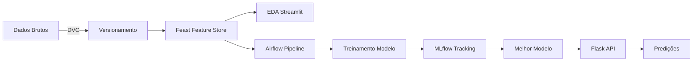

# 🚀 MLOps - Pipeline Completo de Machine Learning

[](https://www.python.org/downloads/)
[](https://mlflow.org/)
[](https://dvc.org/)
[](https://feast.dev/)
[](https://airflow.apache.org/)
[](https://streamlit.io/)

## 📋 Sobre o Projeto

Este projeto demonstra uma implementação completa de um pipeline MLOps para previsão de diabetes, integrando as principais ferramentas e práticas do mercado. O pipeline cobre desde o versionamento de dados até o deployment de modelos em produção.

### 🎯 Objetivos

- Versionamento de dados com **DVC**
- Feature Store com **Feast**
- Análise exploratória interativa com **Streamlit**
- Orquestração de pipelines com **Airflow**
- Tracking de experimentos com **MLflow**
- API REST para servir modelo com **Flask**

## 🏗️ Arquitetura

```
MLOps/
├── data/                      # Dados e versionamento DVC
│   ├── diabetes.csv
│   └── diabetes.csv.dvc
├── feature_repo/              # Feature Store (Feast)
│   ├── feature_store.yaml
│   └── features.py
├── eda/                       # Análise Exploratória
│   └── eda.py
├── airflow/                   # Orquestração
│   ├── dags/
│   ├── docker-compose.yaml
│   └── docker-compose-init.yaml
├── mlflow/                    # Tracking de experimentos
│   └── mlruns/
├── api/                       # API Flask
│   ├── api.py
│   └── request.py
└── notebooks/                 # Notebooks de desenvolvimento
```

## 🛠️ Tecnologias Utilizadas

| Ferramenta | Propósito |
|------------|-----------|
| **DVC** | Versionamento de dados e artefatos |
| **Feast** | Feature Store para features reutilizáveis |
| **Streamlit** | Dashboard interativo para EDA |
| **Airflow** | Orquestração de workflows ML |
| **MLflow** | Tracking de experimentos e modelos |
| **Flask** | API REST para servir predições |
| **Scikit-learn** | Treinamento de modelos ML |
| **Docker** | Containerização do ambiente |

## 📦 Pré-requisitos

- Python 3.8+
- Docker e Docker Compose
- Git

## 🚀 Quick Start

### 1️⃣ Instalação

```bash
# Clone o repositório
git clone https://github.com/velosoberti/MLOps.git
cd MLOps

# Crie um ambiente virtual
python -m venv venv
source venv/bin/activate  # Linux/Mac
# ou
venv\Scripts\activate  # Windows

# Instale as dependências
pip install -r requirements.txt
```

### 2️⃣ Configuração do DVC (Versionamento de Dados)

```bash
# Inicializar DVC
dvc init

# Adicionar arquivo de dados ao DVC
dvc add data/diabetes.csv

# Commitar o arquivo .dvc
git add data/diabetes.csv.dvc data/.gitignore
git commit -m "Inicializar versionamento de dados com DVC"

# Push dos dados para remote (se configurado)
dvc push
```

**Atualizando dados:**

```bash
# Após modificar o arquivo diabetes.csv
dvc add data/diabetes.csv
git add data/diabetes.csv.dvc
git commit -m "Atualizando dataset: adicionadas 2 novas linhas"
dvc push
```

### 3️⃣ Configuração do Feature Store (Feast)

```bash
# Inicializar Feast no repositório pai
cd feature_repo
feast init

# Aplicar as definições de features
feast apply

# Materializar features (se necessário)
feast materialize-incremental $(date -u +"%Y-%m-%dT%H:%M:%S")
```

### 4️⃣ Análise Exploratória (Streamlit)

```bash
# Executar dashboard EDA
cd eda
streamlit run eda.py
```

Acesse o dashboard em: `http://localhost:8501`

### 5️⃣ Orquestração com Airflow

```bash
cd airflow

# Inicializar banco de dados do Airflow (primeira vez)
docker compose -f docker-compose-init.yaml up

# Subir serviços do Airflow
docker compose up -d
```

Acesse a interface do Airflow em: `http://localhost:8080`

**Credenciais padrão:**
- Username: `airflow`
- Password: `airflow`

### 6️⃣ Tracking com MLflow

```bash
# Iniciar servidor MLflow
mlflow ui --host 0.0.0.0 --port 5000
```

Acesse a interface do MLflow em: `http://localhost:5000`

### 7️⃣ API Flask

```bash
cd api

# Iniciar servidor Flask
python api.py
```

**Testar a API:**

```bash
# Em outro terminal
python request.py
```

A API estará disponível em: `http://localhost:5001`

## 📊 Workflow Completo



## 🔄 Pipeline de Treinamento (Airflow)

O pipeline automatizado executa as seguintes etapas:

1. **Setup MLflow** - Configura conexão com tracking server
2. **Load Data** - Carrega dados do Feast Feature Store
3. **Prepare Data** - Prepara features e divide em treino/teste
4. **Train Model** - Treina modelo de Regressão Logística
5. **Evaluate Model** - Calcula métricas de performance
6. **Create Artifacts** - Gera visualizações (matriz de confusão)
7. **Log MLflow** - Registra modelo e métricas no MLflow
8. **Cleanup** - Remove arquivos temporários

## 📈 Métricas Monitoradas

- **Acurácia** (Treino e Teste)
- **Matriz de Confusão**
- **Precisão, Recall e F1-Score**
- **Curva ROC e AUC**
- **Feature Importance**

## 🔧 Comandos Úteis

### DVC

```bash
# Baixar dados do remote
dvc pull

# Verificar status
dvc status

# Restaurar versão anterior
git checkout <commit> data/diabetes.csv.dvc
dvc checkout
```

### Feast

```bash
# Listar feature views
feast feature-views list

# Obter features online
feast materialize-incremental $(date -u +"%Y-%m-%dT%H:%M:%S")
```

### Airflow

```bash
# Ver logs
docker compose logs -f airflow-webserver

# Parar serviços
docker compose down

# Reiniciar
docker compose restart
```

### MLflow

```bash
# Listar experimentos
mlflow experiments list

# Comparar runs
mlflow ui --backend-store-uri sqlite:///mlflow.db
```

## 🧪 Testes

```bash
# Executar testes unitários
pytest tests/

# Testes de integração
pytest tests/integration/

# Coverage
pytest --cov=src tests/
```

## 📝 Estrutura de Dados

**Dataset: Diabetes Prediction**

| Coluna | Tipo | Descrição |
|--------|------|-----------|
| `Insulin` | float | Nível de insulina |
| `SkinThickness` | float | Espessura da pele |
| `DiabetesPedigreeFunction` | float | Função de pedigree |
| `BMI` | float | Índice de massa corporal |
| `Outcome` | int | 0=Não diabético, 1=Diabético |
| `patient_id` | string | Identificador único |
| `event_timestamp` | datetime | Timestamp do evento |

## 🐛 Troubleshooting

### Problema: Airflow não conecta ao MLflow

**Solução:** Verificar a configuração de rede Docker

```bash
# No docker-compose.yaml, adicionar:
extra_hosts:
  - "host.docker.internal:host-gateway"
```

### Problema: DVC não encontra remote

**Solução:** Configurar remote storage

```bash
# Para S3
dvc remote add -d myremote s3://mybucket/path

# Para Google Drive
dvc remote add -d myremote gdrive://folder_id
```

### Problema: Feast não encontra features

**Solução:** Verificar se as features foram aplicadas

```bash
feast apply
feast materialize-incremental $(date -u +"%Y-%m-%dT%H:%M:%S")
```

## 🤝 Contribuindo

1. Fork o projeto
2. Crie uma branch para sua feature (`git checkout -b feature/AmazingFeature`)
3. Commit suas mudanças (`git commit -m 'Add some AmazingFeature'`)
4. Push para a branch (`git push origin feature/AmazingFeature`)
5. Abra um Pull Request

## 📚 Documentação Adicional

- [DVC Documentation](https://dvc.org/doc)
- [Feast Documentation](https://docs.feast.dev/)
- [Airflow Documentation](https://airflow.apache.org/docs/)
- [MLflow Documentation](https://mlflow.org/docs/latest/index.html)
- [Streamlit Documentation](https://docs.streamlit.io/)

## 📄 Licença

Este projeto está sob a licença MIT. Veja o arquivo [LICENSE](LICENSE) para mais detalhes.

## 👤 Autor

**Luis Veloso**

- GitHub: [@velosoberti](https://github.com/velosoberti)

## ⭐ Mostre seu apoio

Dê uma ⭐️ se este projeto te ajudou!

---

<div align="center">
Feito com ❤️ e ☕
</div>