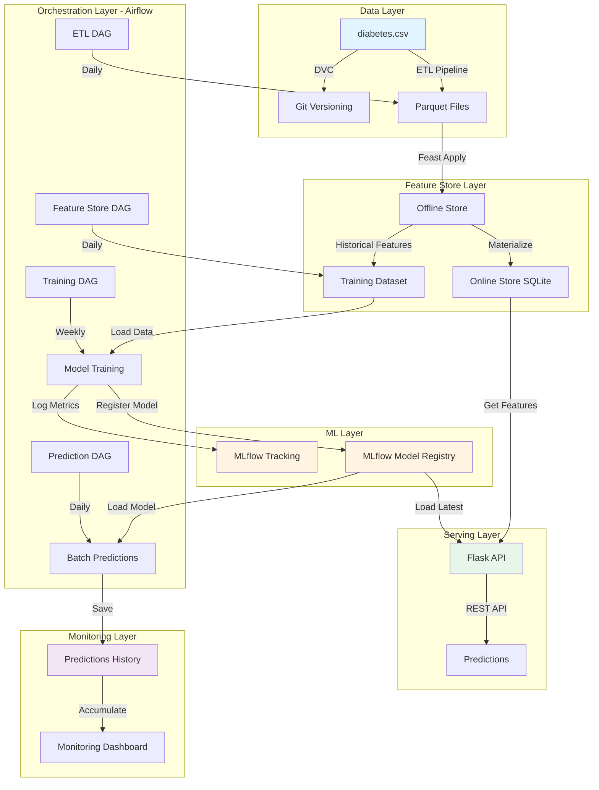
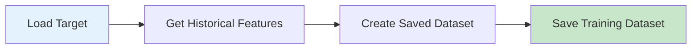
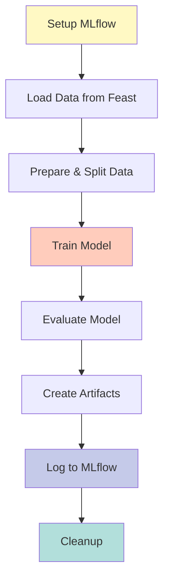
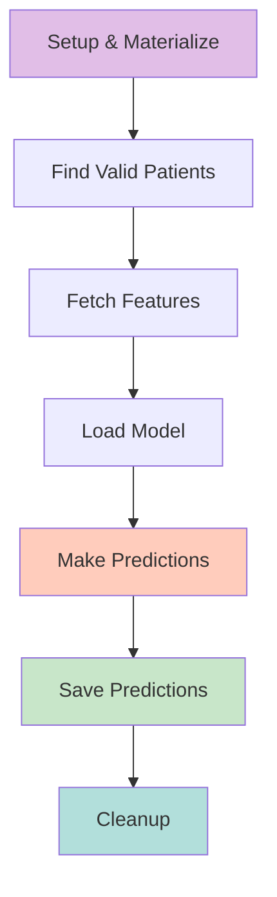

# 🚀 MLOps - Complete Machine Learning Pipeline

[](https://www.python.org/downloads/)
[](https://mlflow.org/)
[](https://dvc.org/)
[](https://feast.dev/)
[](https://airflow.apache.org/)
[](https://streamlit.io/)
[](https://flask.palletsprojects.com/)

## 📋 About the Project

This project demonstrates a **complete and professional end-to-end MLOps pipeline implementation** for diabetes prediction, integrating industry-leading tools and practices. The pipeline covers everything from data versioning to model deployment in production, with continuous prediction monitoring.

### 🎯 Objectives

- ✅ **Data versioning** with DVC
- ✅ **Centralized Feature Store** with Feast (Online + Offline Store)
- ✅ **Interactive exploratory analysis** with Streamlit
- ✅ **Automated pipeline orchestration** with Airflow
- ✅ **Experiment tracking** and model registry with MLflow
- ✅ **Professional REST API** for serving predictions with Flask
- ✅ **Prediction monitoring** with accumulated history
- ✅ **Containerization** with Docker

---

## 🏗️ System Architecture

### Workflow Overview



### Directory Structure

```
MLOps_projects/
├── 📁 data/                        # Data Layer
│   ├── diabetes.csv                # Original dataset (768 records)
│   ├── diabetes.csv.dvc            # DVC metadata
│   └── artifacts/                  # Processed artifacts
│       ├── predictor.parquet       # Features (8 columns + metadata)
│       ├── target.parquet          # Target (Outcome + metadata)
│       ├── predictions/            # Historical predictions
│       │   ├── predictions_history.parquet
│       │   ├── predictions_history.csv
│       │   └── predictions_YYYYMMDD_HHMMSS.parquet
│       └── monitoring/             # Monitoring metrics
│           ├── monitoring_history.parquet
│           └── monitoring_stats_*.json
│
├── 📁 feature_store/               # Feature Store (Feast)
│   ├── feature_repo/               # Feast Repository
│   │   ├── feature_store.yaml      # Feast configuration
│   │   ├── example_repo.py         # Feature definitions
│   │   └── data/                   # Feast Stores
│   │       ├── online_store.db     # SQLite Online Store
│   │       └── registry.db         # Feast Registry
│   └── data/
│       └── my_training_dataset.parquet  # Training dataset
│
├── 📁 etl_functions/               # Reusable ETL Functions
│   ├── etl.py                      # Extract, Transform, Load
│   └── feature_store_creation.py   # Feast dataset creation
│
├── 📁 airflow/                     # Orchestration
│   ├── dags/                       # Airflow DAGs
│   │   ├── etl.py                  # Daily ETL pipeline
│   │   ├── feature_store.py        # Training dataset creation
│   │   ├── train.py                # Training pipeline
│   │   └── predict.py              # Prediction pipeline
│   ├── docker-compose.yaml         # Docker configuration
│   ├── Dockerfile                  # Custom image
│   └── requirements.txt            # Airflow dependencies
│
├── 📁 framework/                   # Reusable ML Framework
│   ├── training.py                 # Training functions
│   ├── prediction.py               # Prediction functions
│   ├── api_constructor.py          # API builder
│   └── api_request.py              # API client
│
├── 📁 mlflow/                      # Tracking and Registry
│   ├── mlruns/                     # Local experiments
│   └── mlartifacts/                # Model artifacts
│
├── 📁 flask/                       # REST API
│   ├── api.py                      # Flask server
│   ├── request.py                  # Test client
│   └── api.log                     # API logs
│
├── 📁 eda_streamlit/               # Exploratory Analysis
│   └── eda.py                      # Interactive dashboard
│
├── 📄 requirements.txt             # Project dependencies
├── 📄 pyproject.toml               # Project configuration
└── 📄 README.md                    # This file
```

---

## 🔄 Detailed Workflows

### 1️⃣ ETL Pipeline (Daily)

**DAG:** `etl_pipeline_final`  
**Frequency:** Daily (`@daily`)  
**Objective:** Process raw data and prepare for Feature Store


**Steps:**

1. **Extract**: Reads `diabetes.csv` (768 records, 9 columns)
2. **Transform**: Separates features (8 columns) and target (Outcome)
3. **Add Timestamps**: Creates incremental timestamps (date_range)
4. **Add Patient IDs**: Generates unique IDs (0 to 767)
5. **Save Parquet**: Saves to `data/artifacts/`

**Outputs:**
- `predictor.parquet`: 768 rows × 10 columns (8 features + patient_id + event_timestamp)
- `target.parquet`: 768 rows × 3 columns (Outcome + patient_id + event_timestamp)

---

### 2️⃣ Feature Store Pipeline (Daily)

**DAG:** `feature_store_cre`  
**Frequency:** Daily (`@daily`)  
**Objective:** Create training dataset with historical features



**Steps:**

1. **Load Target**: Loads `target.parquet` as entity dataframe
2. **Get Historical Features**: Fetches 4 features from Feast Offline Store
3. **Create Saved Dataset**: Registers dataset in Feast Registry
4. **Save Training Dataset**: Saves `my_training_dataset.parquet`

**Features Used:**
- `DiabetesPedigreeFunction` (float)
- `BMI` (float)
- `SkinThickness` (int)
- `Insulin` (int)

**Note:** The model **DOES NOT** use `Glucose`, `Pregnancies`, `BloodPressure`, and `Age`

**Outputs:**
- `feature_store/data/my_training_dataset.parquet`: 768 rows × 7 columns

---

### 3️⃣ Training Pipeline (Weekly)

**DAG:** `ml_training_pipeline`  
**Frequency:** Weekly (`@weekly`)  
**Objective:** Train model and register in MLflow



**Detailed Steps:**

| # | Step | Description | Outputs |
|---|------|-------------|---------|
| 1 | **Setup MLflow** | Configure tracking URI and experiment ID | XCom: mlflow_uri |
| 2 | **Load Data** | Load dataset from Feast | `/tmp/training_data.parquet` |
| 3 | **Prepare Data** | 75/25 stratified split | `/tmp/X_train.parquet`, `/tmp/X_test.parquet` |
| 4 | **Train Model** | LogisticRegression (default params) | `/tmp/model.pkl` |
| 5 | **Evaluate** | Calculate train/test accuracy | XCom: acc_train, acc_test |
| 6 | **Create Artifacts** | Confusion matrix + feature list | `/tmp/confusion_matrix.png` |
| 7 | **Log MLflow** | Register everything in MLflow | MLflow Run |
| 8 | **Cleanup** | Remove temporary files | - |

**Metrics Logged:**
- `acc_train`: Training accuracy (~0.78)
- `acc_test`: Test accuracy (~0.75)

**Artifacts Logged:**
- Trained Model (sklearn)
- Confusion Matrix (PNG)
- Feature List (TXT)

**Parameters Logged:**
```python
{
    "penalty": "l2",
    "solver": "lbfgs",
    "max_iter": 100,
    "n_features": 4,
    "n_train_samples": 576,
    "n_test_samples": 192,
    "train_positive_ratio": 0.349
}
```

**MLflow Tags:**
```python
{
    "model_type": "classification",
    "algorithm": "logistic_regression",
    "dataset": "diabetes_dataset",
    "developer": "airflow_pipeline",
    "environment": "production",
    "orchestrator": "airflow"
}
```

---

### 4️⃣ Prediction Pipeline (Daily)

**DAG:** `ml_prediction_pipeline`  
**Frequency:** Daily (`@daily`)  
**Objective:** Make batch predictions and accumulate history



**Detailed Steps:**

| # | Step | Description | Details |
|---|------|-------------|---------|
| 1 | **Setup & Materialize** | Materialize features to Online Store | `feast materialize_incremental` |
| 2 | **Find Valid Patients** | Find 50 valid patients | Iterate patient_id 1000→1, filter NaN |
| 3 | **Fetch Features** | Fetch from Online Store | `get_online_features()` |
| 4 | **Load Model** | Load from MLflow Registry | `models:/diabete_model/latest` |
| 5 | **Make Predictions** | Generate predictions + probabilities | `predict()` + `predict_proba()` |
| 6 | **Save Predictions** | Save batch + accumulate history | See structure below |
| 7 | **Cleanup** | Remove temporary files | `/tmp/*` |

**Prediction Structure:**
```json
{
    "patient_id": 999,
    "DiabetesPedigreeFunction": 0.627,
    "BMI": 33.6,
    "SkinThickness": 35,
    "Insulin": 0,
    "prediction": 1,
    "probability_class_0": 0.3477,
    "probability_class_1": 0.6523,
    "prediction_timestamp": "2025-11-28T01:44:22",
    "batch_id": "20251128_014422",
    "model_version": 3
}
```

**Outputs:**
- `predictions/predictions_YYYYMMDD_HHMMSS.parquet` (individual batch)
- `predictions/predictions_YYYYMMDD_HHMMSS.csv` (individual batch)
- `predictions/predictions_history.parquet` (accumulated history)
- `predictions/predictions_history.csv` (accumulated history)

---

### 5️⃣ Flask API (Serving)

**Server:** Flask REST API  
**Port:** 5005  
**Objective:** Serve predictions in real-time

#### Available Endpoints

| Method | Endpoint | Description |
|--------|----------|-------------|
| GET | `/health` | Complete health check (API + MLflow + Model) |
| GET | `/model/info` | Information about loaded model |
| POST | `/predict` | Individual prediction |
| POST | `/predict/batch` | Batch prediction (up to 1000 instances) |
| POST | `/model/reload` | Reload model from MLflow |

#### Usage Examples

**1. Health Check:**
```bash
curl http://localhost:5005/health
```

Response:
```json
{
  "status": "healthy",
  "timestamp": "2025-11-28T10:30:00",
  "services": {
    "api": "running",
    "mlflow": {
      "status": "connected",
      "tracking_uri": "http://127.0.0.1:5000/"
    },
    "model": {
      "model_loaded": true,
      "model_version": 3,
      "feature_count": 4
    }
  }
}
```

**2. Individual Prediction:**
```bash
curl -X POST http://localhost:5005/predict \
  -H "Content-Type: application/json" \
  -d '{
    "Insulin": 0,
    "SkinThickness": 35,
    "DiabetesPedigreeFunction": 0.627,
    "BMI": 33.6
  }'
```

Response:
```json
{
  "score": 0.6523,
  "prediction": "diabetes",
  "confidence": 0.6523,
  "model_version": 3,
  "timestamp": "2025-11-28T10:30:00"
}
```

**3. Batch Prediction:**
```bash
curl -X POST http://localhost:5005/predict/batch \
  -H "Content-Type: application/json" \
  -d '{
    "instances": [
      {
        "Insulin": 0,
        "SkinThickness": 35,
        "DiabetesPedigreeFunction": 0.627,
        "BMI": 33.6
      },
      {
        "Insulin": 94,
        "SkinThickness": 28,
        "DiabetesPedigreeFunction": 0.351,
        "BMI": 31.2
      }
    ]
  }'
```

Response:
```json
{
  "predictions": [
    {
      "score": 0.6523,
      "prediction": "diabetes",
      "confidence": 0.6523,
      "instance_index": 0
    },
    {
      "score": 0.3214,
      "prediction": "no_diabetes",
      "confidence": 0.6786,
      "instance_index": 1
    }
  ],
  "total": 2,
  "errors": null,
  "model_version": 3,
  "timestamp": "2025-11-28T10:30:00"
}
```

**4. Model Information:**
```bash
curl http://localhost:5005/model/info
```

Response:
```json
{
  "model_name": "diabete_model",
  "model_version": 3,
  "features": [
    "BMI",
    "DiabetesPedigreeFunction",
    "Insulin",
    "SkinThickness"
  ],
  "feature_count": 4,
  "loaded_at": "2025-11-28T10:00:00",
  "mlflow_tracking_uri": "http://127.0.0.1:5000/",
  "experiment_id": "467326610704772702"
}
```

**5. Reload Model:**
```bash
curl -X POST http://localhost:5005/model/reload
```

Response:
```json
{
  "message": "Model reloaded successfully",
  "previous_version": 3,
  "current_version": 4,
  "reloaded_at": "2025-11-28T10:35:00"
}
```

#### API Features:

✅ Input validation with detailed messages  
✅ Structured logging to file (api.log)  
✅ Complete health check  
✅ Robust error handling  
✅ Security headers (X-Content-Type-Options, X-Frame-Options)  
✅ Response time in header (X-Response-Time)  
✅ Batch support (up to 1000 instances)  
✅ Model reload without restart  

---

## 🛠️ Technologies Used

| Tool | Version | Purpose | Details |
|------|---------|---------|---------|
| Python | 3.8+ | Base language | - |
| DVC | Latest | Data versioning | Tracks diabetes.csv |
| Feast | Latest | Feature Store | Online Store (SQLite) + Offline Store (Parquet) |
| Streamlit | Latest | EDA Dashboard | Interactive exploratory analysis |
| Airflow | 2.x | Orchestration | 4 DAGs (ETL, Feature Store, Train, Predict) |
| MLflow | Latest | Tracking + Registry | Experiments + Versioned models |
| Flask | Latest | REST API | Prediction serving |
| Scikit-learn | Latest | ML Framework | LogisticRegression |
| Docker | Latest | Containerization | Containerized Airflow |
| Pandas | Latest | Data manipulation | DataFrames |
| PyArrow | Latest | Parquet I/O | Efficient read/write |

---

## 📦 Prerequisites

- Python 3.8+
- Docker and Docker Compose
- Git
- 4GB RAM minimum (8GB recommended)
- 5GB disk space

---

## 🚀 Quick Start

### 1️⃣ Installation

```bash
# Clone the repository
git clone https://github.com/velosoberti/MLOps_projects.git
cd MLOps_projects

# Create a virtual environment
python -m venv venv
source venv/bin/activate  # Linux/Mac
# or
venv\Scripts\activate  # Windows

# Install dependencies
pip install -r requirements.txt
```

### 2️⃣ DVC Configuration

```bash
# Initialize DVC (if not already done)
dvc init

# Download versioned data
dvc pull

# Check status
dvc status
```

**Updating data:**
```bash
# After modifying diabetes.csv
dvc add data/diabetes.csv
git add data/diabetes.csv.dvc
git commit -m "Update dataset"
dvc push
```

### 3️⃣ Feast Configuration

```bash
cd feature_store/feature_repo

# Apply feature definitions
feast apply

# Materialize features to Online Store
feast materialize-incremental $(date -u +"%Y-%m-%dT%H:%M:%S")

# Verify feature views
feast feature-views list
```

**Expected output:**
```
NAME                              ENTITIES           TYPE
predictors_df_feature_view        {'patient_id'}     FeatureView
ptarget_df_feature_view           {'patient_id'}     FeatureView
```

### 4️⃣ Exploratory Analysis (Streamlit)

```bash
cd eda_streamlit
streamlit run eda.py
```

Access: http://localhost:8501

### 5️⃣ Orchestration with Airflow

```bash
cd airflow

# First time: Initialize database
docker compose up airflow-init

# Start services
docker compose up -d

# Check logs
docker compose logs -f airflow-webserver
```

Access: http://localhost:8080  
Credentials: `airflow` / `airflow`

**DAG Execution Order:**

1. ✅ `etl_pipeline_final` (generates predictor.parquet and target.parquet)
2. ✅ `feature_store_cre` (creates my_training_dataset.parquet)
3. ✅ `ml_training_pipeline` (trains model and registers in MLflow)
4. ✅ `ml_prediction_pipeline` (makes batch predictions)

**Tip:** Execute manually the first time to ensure correct order.

### 6️⃣ Tracking with MLflow

```bash
# Start MLflow server
mlflow ui --host 0.0.0.0 --port 5000
```

Access: http://localhost:5000

**Register model manually (if necessary):**
```bash
# List runs
mlflow runs list --experiment-id 467326610704772702

# Register model
mlflow models register -m "runs:/<run_id>/model" -n "diabete_model"
```

### 7️⃣ Flask API

```bash
cd flask

# Start server
python api.py
```

Access: http://localhost:5005

**Test API:**
```bash
# Health check
curl http://localhost:5005/health

# Prediction via script
python request.py

# Prediction via curl
curl -X POST http://localhost:5005/predict \
  -H "Content-Type: application/json" \
  -d '{"Insulin": 0, "SkinThickness": 35, "DiabetesPedigreeFunction": 0.627, "BMI": 33.6}'
```

---

## 📊 Monitoring and Observability

### Monitored Metrics

| Metric | Description | Location |
|--------|-------------|----------|
| Training Accuracy | Accuracy on training set | MLflow Metrics |
| Test Accuracy | Accuracy on test set | MLflow Metrics |
| Confusion Matrix | Error visualization (TP, TN, FP, FN) | MLflow Artifacts |
| Feature List | List of features used | MLflow Artifacts |
| Historical Predictions | All accumulated predictions | data/artifacts/predictions/ |
| Class Distribution | Diabetes/non-diabetes proportion | Predictions History |
| Model Version | Version of model used | Predictions History |
| Batch ID | Identifier for each execution | Predictions History |
| Probabilities | P(class 0) and P(class 1) | Predictions History |

### Prediction History Analysis

```python
import pandas as pd

# Load history
history = pd.read_parquet('data/artifacts/predictions/predictions_history.parquet')

# General statistics
print(f"Total predictions: {len(history)}")
print(f"Total batches: {history['batch_id'].nunique()}")
print(f"Diabetes proportion: {history['prediction'].mean():.2%}")
print(f"First prediction: {history['prediction_timestamp'].min()}")
print(f"Last prediction: {history['prediction_timestamp'].max()}")

# Analysis by batch
batch_stats = history.groupby('batch_id').agg({
    'prediction': ['count', 'mean'],
    'probability_class_1': ['mean', 'std', 'min', 'max']
})
print(batch_stats)

# Probability distribution
import matplotlib.pyplot as plt
history['probability_class_1'].hist(bins=50)
plt.xlabel('Diabetes Probability')
plt.ylabel('Frequency')
plt.title('Probability Distribution')
plt.show()

# Temporal analysis
history['date'] = pd.to_datetime(history['prediction_timestamp']).dt.date
daily_stats = history.groupby('date').agg({
    'prediction': ['count', 'mean']
})
print(daily_stats)
```

---

## 🔧 Useful Commands

### DVC

```bash
# Download data from remote
dvc pull

# Check status
dvc status

# Restore previous version
git checkout <commit> data/diabetes.csv.dvc
dvc checkout

# Configure S3 remote
dvc remote add -d myremote s3://mybucket/path
dvc remote modify myremote access_key_id <KEY>
dvc remote modify myremote secret_access_key <SECRET>

# Configure Google Drive remote
dvc remote add -d myremote gdrive://folder_id

# Configure local remote
dvc remote add -d myremote /path/to/storage

# Push data
dvc push
```

### Feast

```bash
# List feature views
feast feature-views list

# Materialize features
feast materialize-incremental $(date -u +"%Y-%m-%dT%H:%M:%S")

# Get online features (test)
feast get-online-features \
  --feature-view predictors_df_feature_view \
  --entity patient_id=1

# Validate configuration
feast validate

# List entities
feast entities list

# Describe feature view
feast feature-views describe predictors_df_feature_view
```

### Airflow

```bash
# View logs
docker compose logs -f airflow-webserver

# Stop services
docker compose down

# Restart services
docker compose restart

# Access scheduler container
docker compose exec airflow-scheduler bash

# Access webserver container
docker compose exec airflow-webserver bash

# Force DAG refresh
docker compose exec airflow-webserver airflow dags list

# Trigger DAG manually
docker compose exec airflow-scheduler airflow dags trigger etl_pipeline_final

# Check DAG status
docker compose exec airflow-scheduler airflow dags list-runs -d etl_pipeline_final

# Clean up (remove volumes)
docker compose down -v
```

### MLflow

```bash
# Start UI
mlflow ui --host 0.0.0.0 --port 5000

# List experiments
mlflow experiments list

# List runs
mlflow runs list --experiment-id <ID>

# Register model
mlflow models register -m "runs:/<run_id>/model" -n "model_name"

# Serve model
mlflow models serve -m "models:/model_name/latest" -p 5001

# Get model info
mlflow models describe -m "models:/model_name/latest"
```

### Flask API

```bash
# Start API
python flask/api.py

# Test health
curl http://localhost:5005/health

# Test prediction
python flask/request.py

# View logs
tail -f flask/api.log
```

---

## 🐛 Troubleshooting

### Common Issues

#### Problem: Airflow DAG not appearing

**Cause:** Syntax error or import error in DAG file

**Solution:**
```bash
# 1. Check logs
docker compose logs airflow-scheduler

# 2. Verify DAG syntax
docker compose exec airflow-webserver python /opt/airflow/dags/etl.py

# 3. Force refresh
docker compose exec airflow-webserver airflow dags list-import-errors
```

#### Problem: Predictions with NaN

**Cause:** Features not materialized in Online Store

**Solution:**
```bash
cd feature_store/feature_repo
feast materialize-incremental $(date -u +"%Y-%m-%dT%H:%M:%S")
```

#### Problem: MLflow model not loading

**Cause:** Model not registered or wrong version

**Solution:**
```bash
# Check available models
mlflow models list

# Check model versions
mlflow models describe -m "models:/diabete_model/latest"

# Re-register model if needed
mlflow models register -m "runs:/<run_id>/model" -n "diabete_model"
```

#### Problem: Docker containers using too much memory

**Cause:** Multiple Airflow workers running

**Solution:**
```bash
# Adjust docker-compose.yaml
# Change AIRFLOW__CELERY__WORKER_CONCURRENCY from 4 to 2

# Restart
docker compose down
docker compose up -d
```

---

## 🤝 Contributing

1. Fork the project
2. Create a branch for your feature (`git checkout -b feature/AmazingFeature`)
3. Commit your changes (`git commit -m 'Add some AmazingFeature'`)
4. Push to the branch (`git push origin feature/AmazingFeature`)
5. Open a Pull Request

---

## 📚 Additional Documentation

- [DVC Documentation](https://dvc.org/doc)
- [Feast Documentation](https://docs.feast.dev/)
- [Airflow Documentation](https://airflow.apache.org/docs/)
- [MLflow Documentation](https://mlflow.org/docs/latest/index.html)
- [Streamlit Documentation](https://docs.streamlit.io/)
- [Flask Documentation](https://flask.palletsprojects.com/)

---

## 📄 License

This project is licensed under the MIT License. See the LICENSE file for details.

---

## 👤 Author

**Your Name**

- GitHub: [@velosoberti](https://github.com/velosoberti)
- LinkedIn: [Your LinkedIn](https://linkedin.com/in/yourprofile)

---

## 🙏 Acknowledgments

- Diabetes dataset from [Kaggle](https://www.kaggle.com/)
- MLOps community for best practices
- All open-source tools used in this project

---

## 📈 Project Status

🟢 **Active Development** - This project is actively maintained and updated regularly.

**Last Updated:** November 28, 2025